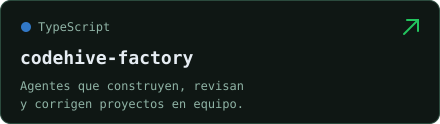
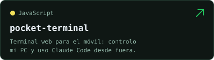
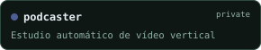
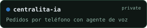
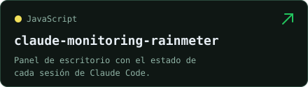
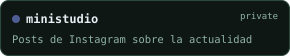

<strong>Desarrollador full stack · Entusiasta de la IA · Siempre construyendo</strong>

Construyo herramientas para lo que necesito y experimentos para lo que me da curiosidad. Soy Daniel, desarrollador full stack en España, con mucho interés por la IA, la automatización y por entender cómo funcionan las cosas. Uso la IA en todo mi proceso de desarrollo y disfruto explorando agentes, modelos locales e integraciones que resuelven problemas reales. De aplicaciones para empresas a experimentos personales, me gusta llevar las ideas desde el “¿y si…?” hasta algo funcionando en mi propio servidor. Este GitHub es mi laboratorio personal, donde la curiosidad se convierte en proyectos y siempre hay algo nuevo en marcha.

  
  
  
  
  
  

  
  

