<a href="README.md" lang="en">English</a> · <strong>Español</strong>

  

  <strong>AI tinkerer · Builder · Experimenter</strong> 
  Aplicaciones, agentes y experimentos que empiezan con un «¿y si…?».

## Construyo lo que imagino.

Soy Daniel, desarrollador full stack y entusiasta de la inteligencia artificial. Construyo herramientas para lo que necesito y experimento con lo que me da curiosidad. La IA forma parte de mi forma de trabajar: la utilizo para explorar ideas, desarrollar y llevar proyectos a la práctica.

Este GitHub es mi laboratorio personal. Aquí encontrarás aplicaciones, automatizaciones y experimentos en distintas fases de desarrollo. Siempre hay algo en construcción.

## Dentro del laboratorio

<strong><a href="https://github.com/Dasge97/codehive-factory">Code Hive Factory ↗</a></strong> Agentes que construyen, revisan y corrigen proyectos en equipo.

 

<strong><a href="https://github.com/Dasge97/pocket-terminal">Pocket Terminal ↗</a></strong> Tu terminal de Windows, desde el móvil.

  <a href="https://github.com/Dasge97?tab=repositories">Explorar todos los repositorios →</a>

## Mi caja de herramientas

  
  
  
  
  
  
  
  
  

<strong>En qué me gusta meter las manos</strong>

- **Agentes de IA:** herramientas, contexto y colaboración entre agentes.
- **Automatización:** conectar aplicaciones, datos y procesos reales.
- **IA aplicada:** documentos, conocimiento, voz y generación de contenido.
- **Infraestructura propia:** desplegar aplicaciones y experimentar con modelos locales.

---

<samp>idea → build → test → learn → repeat</samp>

