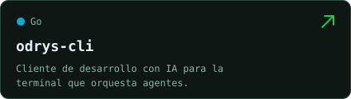
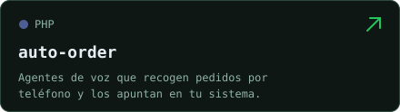
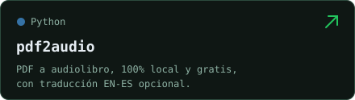

<a href="README.md">English</a> · <strong>Español</strong>

  

<strong>Desarrollador full stack · Entusiasta de la IA · Siempre construyendo</strong>

 

Construyo herramientas para lo que necesito y experimentos para lo que me da curiosidad. Agentes de IA, automatización y aplicaciones prácticas: desde la primera idea hasta ponerlas a funcionar en mi propio servidor.

 

  
  

  
  

  
  

<a href="https://github.com/Dasge97?tab=repositories">Más proyectos ↗</a>

 

  

