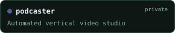
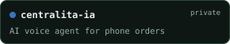
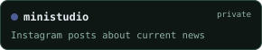

<strong>English</strong> · <a href="README.es.md">Español</a>

<strong>Full-stack developer · AI enthusiast · Always building</strong>

I build tools for things I need and experiments for things I’m curious about. I’m Daniel, a full-stack developer based in Spain with a strong interest in AI, automation and understanding how things work. I use AI throughout my development process and enjoy exploring agents, local models and integrations that solve real problems. From business applications to personal experiments, I like taking ideas all the way from “what if?” to something running on my own server. This GitHub is my personal lab, where curiosity turns into projects and there’s always something new in the works.

  
  
  
  
  
  

