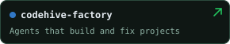
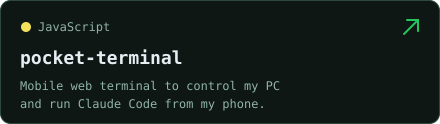
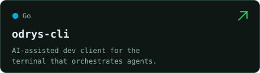
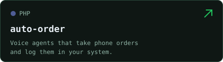
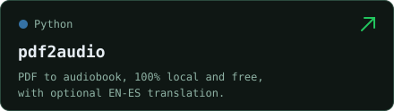
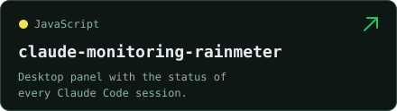

<strong>English</strong> · <a href="README.es.md">Español</a>

  

<strong>Full-stack developer · AI enthusiast · Always building</strong>

 

I build tools for things I need and experiments for things I’m curious about. AI agents, automation and practical applications — from the first idea to running on my own server.

 

  
  

  
  

  
  

<a href="https://github.com/Dasge97?tab=repositories">More projects ↗</a>

 

  

