<strong>English</strong> · <a href="README.es.md" lang="es">Español</a>

  

  <strong>AI tinkerer · Builder · Experimenter</strong> 
  Apps, agents and experiments that start with “what if…?”.

## I build what I imagine.

I’m Daniel, a full-stack developer and AI enthusiast. I build tools for things I need and experiment with things I’m curious about. AI is part of how I work: I use it to explore ideas, develop software and bring projects to life.

This GitHub is my personal lab. You’ll find applications, automations and experiments at different stages of development. There’s always something in the works.

  

## Inside the lab

  
  

  <a href="https://github.com/Dasge97?tab=repositories">Explore all repositories →</a>

## My toolbox

  
  
  
  
  
   
  
  
  
  

<strong>What I like working on</strong>

- **AI agents:** tools, context and collaboration between agents.
- **Automation:** connecting applications, data and real-world workflows.
- **Applied AI:** documents, knowledge, voice and content generation.
- **Self-hosting:** deploying applications and experimenting with local models.

---

<samp>idea → build → test → learn → repeat</samp>

